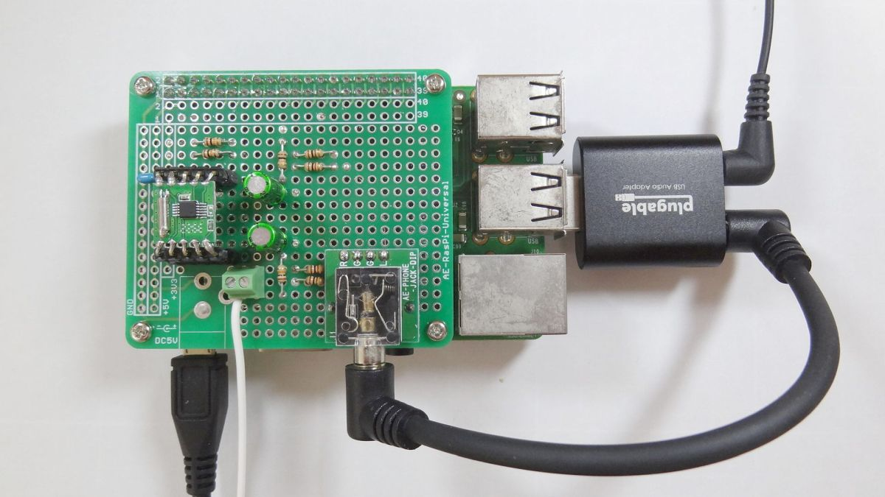
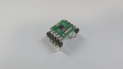
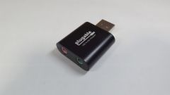
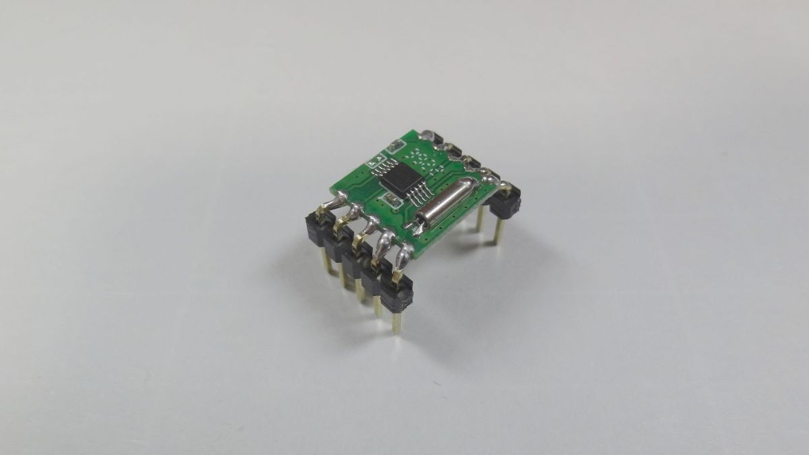
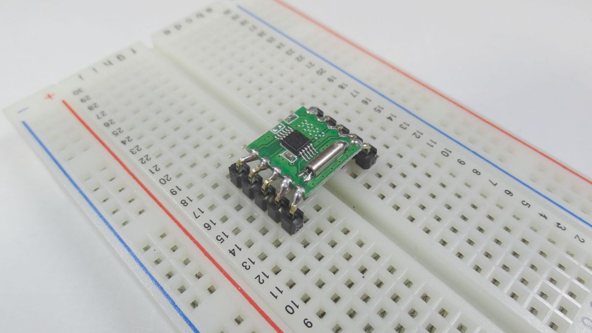

# Radio Recording Server
「Radio Recording Server」は、ラジオ録音サーバーです。  
「Radio Recording Server」は、FMラジオを予約録音することができます。  
「Radio Recording Server」は、オープンソースハードウェアです。  
  
  
  
<kbd></kbd>

# 目次
* [1. 概要](#1-概要)
* [2. ハードウェア仕様](#2-ハードウェア仕様)
* [3. 配線](#3-配線)
* [4. Raspberry Pi のOSのセットアップ](#4-raspberry-pi-のosのセットアップ)
* [5. Raspberry Pi のオーディオのセットアップ](#5-raspberry-pi-のオーディオのセットアップ)
* [6. ソフトウェアのセットアップ](#6-ソフトウェアのセットアップ)
* [7. 使用方法](#7-使用方法)
* [追加の情報](#追加の情報)
* [License (ライセンス)](#license-ライセンス)

# 1. 概要

* **主な機能**  
   * **ラジオを聴くことができる**  
      FMラジオモジュールを使用して、FMラジオの音声を受信します。受信したラジオの音声は、FMラジオモジュール⇒USBオーディオアダプタのマイク端子⇒USBオーディオアダプタのヘッドホン端子⇒スピーカー、と経由して、聴くことができます。「USBオーディオアダプタのマイク端子⇒USBオーディオアダプタのヘッドホン端子」については、「マイク端子の入力音声をヘッドホン端子にループバックするモジュール」である、[PulseAudio](https://www.freedesktop.org/wiki/Software/PulseAudio/)の「module-loopback」を利用します。
   * **ラジオを録音することができる**  
      [FFmpeg](https://ffmpeg.org/)を利用して、USBオーディオアダプタのマイク端子からの入力を、MP3ファイルとして保存します。
   * **ラジオを予約録音することができる**  
      [cron](https://en.wikipedia.org/wiki/Cron)を利用して、所望の曜日、時刻に、ラジオを録音します。

* **主な部品**  
   * **マイコンボード**  
      マイコンボードとしては、Raspberryp Pi を使用します。Raspberry Pi 3, Raspberry Pi 4, Raspberry Pi Zero W, Raspberry Pi Zero 2 W 等、Raspberry Pi OSが動作するRaspberry Pi が使用可です。Raspberry Pi OS が動作しない Raspberry Pi Pico は使用不可です。   
        
   * **FMラジオモジュール**  
      FMラジオモジュールを使用して、FMラジオの音声を受信します。amazon等で1個あたり200円しない価格で販売されている「RDA5807Mを使用したFMラジオモジュール」を使用します。  
        
   * **USBオーディオアダプタ**  
      受信したラジオ音声は、USBオーディオアダプタのマイク端子を通して、Raspberry Pi に入力します。マイク端子から入力した音声は、USBオーディオアダプタのヘッドホン端子から出力し、ラジオ音声をスピーカーで聴くことができます。  
        

# 2. ハードウェア仕様

* **FMラジオモジュールまわりの回路図**  
   <kbd></kbd>  
   | 回路部品名 | 部品詳細 | 備考、目的、効果 |
   | --- | --- | --- |
   | | Raspberry Pi | Raspberry Pi OSが動作するRaspberry Pi |
   | | RRD-102(RDA5807M) | FMラジオモジュール |
   | C1 | 積層セラミックコンデンサ0.1μF(=100nF) | バイパスコンデンサ。IC(RDA5807M)への入力電圧の変動を防ぎます。 |
   | R1, R2 | 抵抗10kΩ | プルアップ抵抗。I2C通信の信号線には、プルアップ抵抗が必要です。 |
   | C3, C4 | 無極性電解コンデンサ4.7μF | ACカップリングのためのコンデンサ。RDA5807Mから出力される音声信号から直流(DC)成分を除去します。 |
   | R3, R4 | 抵抗10kΩ | ACカップリングのための抵抗。直流(DC)成分を除去した出力電圧の基準電圧をゼロにします。 |
   | R5, R6 / R7, R8 | 抵抗1kΩ / 抵抗100Ω | 分圧のための抵抗。RDA5807Mから出力される音圧レベルが高いので、音圧レベルを 1/11 にします。1kΩ抵抗と100Ω抵抗の分圧回路の場合、入力電圧は、100/(1k+100) = 1/11になります。(1/11 という値は、ラジオを録音した音声ファイルの音量がほどよくなる音圧レベルを試行錯誤した結果の値です) |
   | U1 | オーディオジャック | 3.5mmステレオミニジャック |

* **３つの版(ブレッドボード 版、Raspberry Pi 3/4 シールド 版、Raspberry Pi Zero シールド板)で、共通で必要な部品と、版固有で必要な部品とがありまあす。**

* **「ブレッドボード 版」に固有で必要な部品**  
   | 部品名 | 商品例 | 数量 |
   | --- | --- | --- |
   | Raspberry Pi | [Raspberry Pi 4](https://akizukidenshi.com/catalog/g/gM-14839/) (Raspberry Pi 3, Raspberry Pi Zero W, Raspberry Pi Zero 2 W 等、Raspberry Pi OSが動作するRaspberry Pi でも可。Raspberry Pi OS が動作しない Raspberry Pi Pico は不可) | 1個 |
   | USB ACアダプター | [スイッチングACアダプター](https://akizukidenshi.com/catalog/g/gM-16293/) (使用するRaspberry Piの仕様に適合したUSB ACアダプター)| 1個 |
   | ブレッドボード | [ブレッドボード EIC-801](https://akizukidenshi.com/catalog/g/gP-00315/) | 1個 |
   | 配線用のジャンパーワイヤ | [ジャンパーワイヤ（オス－メス）](https://akizukidenshi.com/catalog/g/gC-08932/) | 適量 |

* **「Raspberry Pi 3/4 シールド 版」に固有で必要な部品**  
   | 部品名 | 商品例 | 数量 |
   | --- | --- | --- |
   | Raspberry Pi | [Raspberry Pi 4](https://akizukidenshi.com/catalog/g/gM-14839/) (Raspberry Pi 3でも可) | 1個 |
   | USB ACアダプター | [スイッチングACアダプター](https://akizukidenshi.com/catalog/g/gM-16293/) (使用するRaspberry Piの仕様に適合したUSB ACアダプター)| 1個 |
   | 基板 | [Raspberry Pi用ユニバーサル基板](https://akizukidenshi.com/catalog/g/gP-11073/) | 1枚 |
   | Raspberry Pi と連結するためのピンソケット | [ピンソケット (メス) 2×20 (40P)](https://akizukidenshi.com/catalog/g/gC-00085/) | 1個 |
   | アンテナ線を固定連結するためのターミナルブロック | [ターミナルブロック 2.54mm 2P 緑 縦](https://akizukidenshi.com/catalog/g/gP-14217/) | 1個 |
   | FMラジオモジュール を連結するためのピンソケット | [シングルピンソケット(低メス) 1×20 (20P)](https://akizukidenshi.com/catalog/g/gC-03138/) | 1個 |
   | 配線用のスズメッキ線 | [スズメッキ線 (0.6mm 10m)](https://akizukidenshi.com/catalog/g/gP-02220/) | 適量 |

* **「Raspberry Pi Zero シールド 版」に固有で必要な部品**  
   | 部品名 | 商品例 | 数量 |
   | --- | --- | --- |
   | Raspberry Pi | [Raspberry Pi Zero W](https://www.switch-science.com/products/3200) (Raspberry Pi Zero 2 W でも可) | 1個 |
   | USB ACアダプター | [スイッチングACアダプター](https://akizukidenshi.com/catalog/g/gM-16293/) (使用するRaspberry Piの仕様に適合したUSB ACアダプター)| 1個 |
   | USB-microB OTGケーブル | [USB(microB to A)変換アダプター](https://amzn.to/3qiBtwj) | 1個 |
   | Raspberry Pi Zeroに取り付けるピンヘッダ | [ピンヘッダ 2×20 (40P)](https://akizukidenshi.com/catalog/g/gC-00080/) | 1個 |
   | 基板 | [Raspberry Pi Zero用ユニバーサル基板](https://akizukidenshi.com/catalog/g/gP-14031/) | 1枚 |
   | Raspberry Pi と連結するためのピンソケット | [ピンソケット (メス) 2×20 (40P)](https://akizukidenshi.com/catalog/g/gC-00085/) | 1個 |
   | アンテナ線を固定連結するためのターミナルブロック | [ターミナルブロック 2.54mm 2P 緑 縦](https://akizukidenshi.com/catalog/g/gP-14217/) | 1個 |
   | FMラジオモジュール を連結するためのピンソケット | [シングルピンソケット(低メス) 1×20 (20P)](https://akizukidenshi.com/catalog/g/gC-03138/) | 1個 |
   | 配線用のスズメッキ線 | [スズメッキ線 (0.6mm 10m)](https://akizukidenshi.com/catalog/g/gP-02220/) | 適量 |

* **共通で必要な基本部品**  
   | 部品名 | 商品例 | 数量 |
   | --- | --- | --- |
   | microSDカード | [サンディスク microSD 32GB](https://amzn.to/3OFqpmf) | 1個 |
   | USBオーディオアダプタ | [USB オーディオ アダプタ 3.5mm ヘッドホン・マイク端子付](https://amzn.to/45oXdpp) | 1個 |
   | FMラジオモジュール | [FMラジオモジュール RDA5807M RRD-102](https://amzn.to/3NTdlth) | 1個 |
   | FMラジオモジュールのピッチ変換のための2.54mmピッチのL型のピンヘッダ | [ピンヘッダ(オスＬ型) 1×40 (40P)](https://akizukidenshi.com/catalog/g/gC-01627/) | 1個 |
   | 配線用ビニール線、アンテナ用ビニール線 | [耐熱通信機器用ビニル電線 2m×10色 導体径0.65mm 単芯](https://akizukidenshi.com/catalog/g/gP-08996/) | 適量 |
   | スピーカー | [ミニスピーカー](https://jp.daisonet.com/products/4549131578874) (3.5mm ステレオミニプラグのあるもの。イヤホンやヘッドホンでも可) | 1個 |

* **共通で必要なブレッドボードや基板に乗せる部品**  
   | 部品名 | 商品例 | 数量 |
   | --- | --- | --- |
   | 10kΩ抵抗 | [カーボン抵抗(炭素皮膜抵抗) 1/6W 10kΩ](https://akizukidenshi.com/catalog/g/gR-16103/) | 4本 |
   | 1kΩ抵抗 | [カーボン抵抗(炭素皮膜抵抗) 1/6W 1kΩ](https://akizukidenshi.com/catalog/g/gR-16102/) | 2本 |
   | 100Ω抵抗器 | [カーボン抵抗(炭素皮膜抵抗) 1/6W 100Ω](https://akizukidenshi.com/catalog/g/gR-16101/) | 2本 |
   | 0.1μFコンデンサ | [積層セラミックコンデンサー 0.1μF](https://akizukidenshi.com/catalog/g/gP-15927/) | 1個 |
   | 4.7μFコンデンサ | [オーディオ用無極性電解コンデンサー 4.7μF](https://akizukidenshi.com/catalog/g/gP-04623/) | 2個 |
   | 3.5mmステレオミニジャック | [3.5mmステレオミニジャックDIP化キット](https://akizukidenshi.com/catalog/g/gK-05363/) | 1 |

* **動作上は無くても問題ないが、あるとよい、スペーサー部品**  
   | 部品名 | 商品例 | 数量 |
   | --- | --- | --- |
   | ネジ(M2.6) | [なべ小ねじ M2.6×5](https://akizukidenshi.com/catalog/g/gP-07324/) | 4個 |
   | 金属スペーサー(M2.6 長さ11mm) | [六角オネジ・メネジ MB26-11](https://akizukidenshi.com/catalog/g/gP-11546/) | 4個 |
   | 金属スペーサー(M2.6 長さ7mm) | [六角両メネジ FB26-7](https://akizukidenshi.com/catalog/g/gP-07311/) | 4個 |

* **RDA5807Mを使用したFMラジオモジュールのピッチ変換**  
   「RDA5807Mを使用したFMラジオモジュール」のピンピッチが2.54mmではなく、2.00mmなので、2.54mmピッチのL型のピンヘッダのピンをペンチで向きを調整し、「RDA5807Mを使用したFMラジオモジュール」にはんだ付けし、ピンピッチを2.54mmにします。「2.54mmピッチのL型のピンヘッダ」の２列の間隔は、6ピッチ分 (2.54mm× 6ピッチ分 = 15.24mmほど) にします。  
     
   

# 3. 配線

* **配線表**  
   | FMラジオモジュール ピン番号 | FMラジオモジュール ピン名称 | 接続先 (Raspberry Pi、オーディオジャック) |
   | --- | --- | --- |
   | 1 | SDA | Raspberry Piの3番ピン(GPIO2,SDA) および 10kΩ抵抗を経由して3V3 |
   | 2 | SCL | Raspberry Piの5番ピン(GPIO2,SDA) および 10kΩ抵抗を経由して3V3 |
   | 3 | NC | (無接続) |
   | 4 | NC | (無接続) |
   | 5 | 3V3 | Raspberry Piの1番ピン(3V3) および 0.1μFコンデンサを経由してGND |
   | 6 | GND | GND |
   | 7 | L OUT	 | ACカップリング回路、分圧回路を経由して、オーディオジャックのLピン |
   | 8 | R OUT	 | ACカップリング回路、分圧回路を経由して、オーディオジャックのRピン |
   | 9 | NC | (無接続) |
   | 10 | ANT | アンテナ用ビニール線 |

* **「ブレッドボード 版」の配線**  
     
     

* **「Raspberry Pi 3/4 シールド 版」の配線**  
   配線図では基板の表側を配線が這っていますが、実際には、裏側を這わせます。  
     
     

* **「Raspberry Pi Zero シールド 版」の配線**  
   配線図では基板の表側を配線が這っていますが、実際には、裏側を這わせます。配線を確認できるよう、コンデンサ、オーディオジャックを基板の下方に配置していますが、実際には、基板上に配置します。  
     
     


# 4. Raspberry Pi のOSのセットアップ
https://www.hiramine.com/physicalcomputing/radio_recording_server/04_raspi_os_setup.html

- micro SDカードへRaspberry Pi OSの書き込み
- 初回起動と初期設定
- アップデート可能なパッケージの更新
- Sambaの設定
- I2C通信の有効化
- Python-smbusのインストール
- gitのインストール
- FFmpegのインストール

# 5. Raspberry Pi のオーディオのセットアップ
https://www.hiramine.com/physicalcomputing/radio_recording_server/05_raspi_audio_setup.html

- PulseAudio のインストール
- PulseAudioを、ログインせずとも自動起動するようにする
- USBオーディオアダプタの設定

# 6. ソフトウェアのセットアップ

1. プログラムファイルのダウンロード
   ```shell
   $ cd ~
   $ git clone https://github.com/nobukihiramine/RadioRecordingServer
   ```
2. シェルスクリプトファイルに実行権限の付与
   ```shell
   $ chmod +x ./RadioRecordingServer/*.sh
   ```

# 7. 使用方法

* **ラジオを聴く**  
   ラジオを聴くことを開始する
   ```shell
   $ ./RadioRecordingServer/listen_on.sh (聞きたいラジオ周波数[MHz])
   ```
   ラジオを聴く周波数を変更する
   ```shell
   $ ./RadioRecordingServer/listen_tune.sh (聞きたいラジオ周波数[MHz])
   ```
   ラジオを聴くことを終了する
   ```shell
   $ ./RadioRecordingServer/listen_off.sh
   ```

* **ラジオを録音する**  
   ```shell
   $ ./RadioRecordingServer/record.sh 周波数[MHz] 録音時間[分] MP3ビットレート[kbps] 出力ディレクトリパス 予約録音名
   ```

* **ラジオを予約録音する**  
   以下の書式で、コマンドの予約実行をcron設定します。
   ```shell
   分 時 日 月 曜日 ./RadioRecordingServer/record.sh 周波数[MHz] 録音時間[分] MP3ビットレート[kbps] 出力ディレクトリパス 予約録音名
   ```

* **cron設定例**  
   TBSラジオ Junk (月曜-金曜 25:00-27:00)
   ```shell
   # JUNK
   0 1 * * tue ./RadioRecordingServer/record.sh 90.5 120 64 "./rec/" "伊集院光 深夜の馬鹿力"
   0 1 * * wed ./RadioRecordingServer/record.sh 90.5 120 64 "./rec/" "爆笑問題カーボーイ"
   0 1 * * thu ./RadioRecordingServer/record.sh 90.5 120 64 "./rec/" "山里亮太の不毛な議論"
   0 1 * * fri ./RadioRecordingServer/record.sh 90.5 120 64 "./rec/" "おぎやはぎのメガネびいき"
   0 1 * * sat ./RadioRecordingServer/record.sh 90.5 120 64 "./rec/" "バナナマンのバナナムーンGOLD"
   ```
   ニッポン放送 オールナイトニッポン (月曜-土曜 25:00-27:00)
   ```shell
   # オールナイトニッポン
   0 1 * * tue ./RadioRecordingServer/record.sh 93.0 120 64 "./rec/" "Adoのオールナイトニッポン"
   0 1 * * wed ./RadioRecordingServer/record.sh 93.0 120 64 "./rec/" "星野源のオールナイトニッポン"
   0 1 * * thu ./RadioRecordingServer/record.sh 93.0 120 64 "./rec/" "乃木坂46のオールナイトニッポン"
   0 1 * * fri ./RadioRecordingServer/record.sh 93.0 120 64 "./rec/" "ナインティナインのオールナイトニッポン"
   0 1 * * sat ./RadioRecordingServer/record.sh 93.0 120 64 "./rec/" "霜降り明星のオールナイトニッポン"
   0 1 * * sun ./RadioRecordingServer/record.sh 93.0 120 64 "./rec/" "オードリーのオールナイトニッポン"
   ```
   ニッポン放送 オールナイトニッポン0(zero) (月曜-木曜 27:00-28:30 / 金曜 27:00-29:00)
   ```shell
   # オールナイトニッポン0(ZERO)
   0 3 * * tue ./RadioRecordingServer/record.sh 93.0 90 64 "./rec/" "フワちゃんのオールナイトニッポン0"
   0 3 * * wed ./RadioRecordingServer/record.sh 93.0 90 64 "./rec/" "あののオールナイトニッポン0"
   0 3 * * thu ./RadioRecordingServer/record.sh 93.0 90 64 "./rec/" "佐久間宣行のオールナイトニッポン0"
   0 3 * * fri ./RadioRecordingServer/record.sh 93.0 90 64 "./rec/" "マヂカルラブリーのオールナイトニッポン0"
   0 3 * * sat ./RadioRecordingServer/record.sh 93.0 120 64 "./rec/" "三四郎のオールナイトニッポン0"
   ```

* **補足）record.shのWAV2MP3モード**  
   record.sh の引数の「予約録音名」の後ろに任意の文字列（たとえば「wav2mp3」）を追加すると、WAV2MP3モードが有効になります。WAV2MP3モードの場合、「ラジオ音声をリアルタイムではWAVとして保存し、後で、WAVをMP3に変換する」動作になります。「予約録音名」の後ろに文字列を追加しない場合は、「ラジオ音声をリアルタイムでMP3に変換する」動作になります。  

   マイコンボードとして、「Raspberry Pi Zero W」を使用した場合は、性能不足のため「ラジオ音声をリアルタイムでMP3に変換」がうまくいかないので、「ラジオを録音する」「ラジオを予約録音する」際には、record.sh の引数の「予約録音名」の後ろに任意の文字列（たとえば「wav2mp3」）を追加し、WAV2MP3モードを有効にします。  

   **ラジオを録音する**  
   以下の書式で、コマンドを実行します。（「予約録音名」の後ろに「wav2mp3」を追加します）
   ```shell
   $ ./RadioRecordingServer/record.sh 周波数[MHz] 録音時間[分] MP3ビットレート[kbps] 出力ディレクトリパス 予約録音名 wav2mp3
   ```
   **ラジオを予約録音する**  
   以下の書式で、コマンドの予約実行をcron設定します。（「予約録音名」の後ろに「wav2mp3」を追加します）
   ```shell
   分 時 日 月 曜日 ./RadioRecordingServer/record.sh 周波数[MHz] 録音時間[分] MP3ビットレート[kbps] 出力ディレクトリパス 予約録音名 wav2mp3
   ```

# 追加の情報
* [FMラジオモジュールまわりの回路図のファイル](https://www.hiramine.com/physicalcomputing/radio_recording_server/radio_recording_server_schematic_diagram_v1.pdf)
* [ラジオ録音サーバー を作る （ FMラジオモジュール + Raspberry Pi + USBオーディオアダプタ )](https://www.hiramine.com/physicalcomputing/radio_recording_server/index.html)

# License (ライセンス)
Copyright 2023 Nobuki HIRAMINE  
The source code is licensed under the Apache License, Version 2.0.  
See the [LICENSE](LICENSE) file for more details.  
(ソースコードのライセンスは、「Apache License, Version 2.0」です。  
詳細は「[LICENSE](LICENSE)」ファイルを参照ください。)
